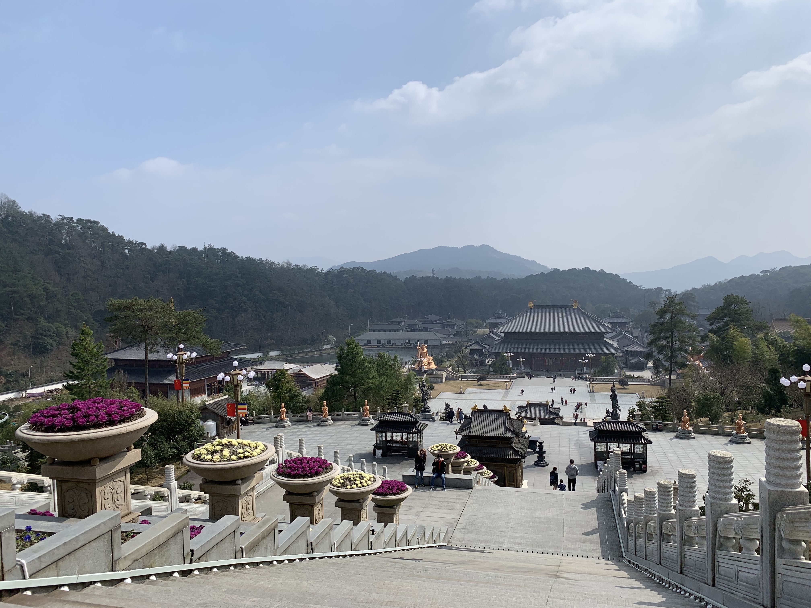
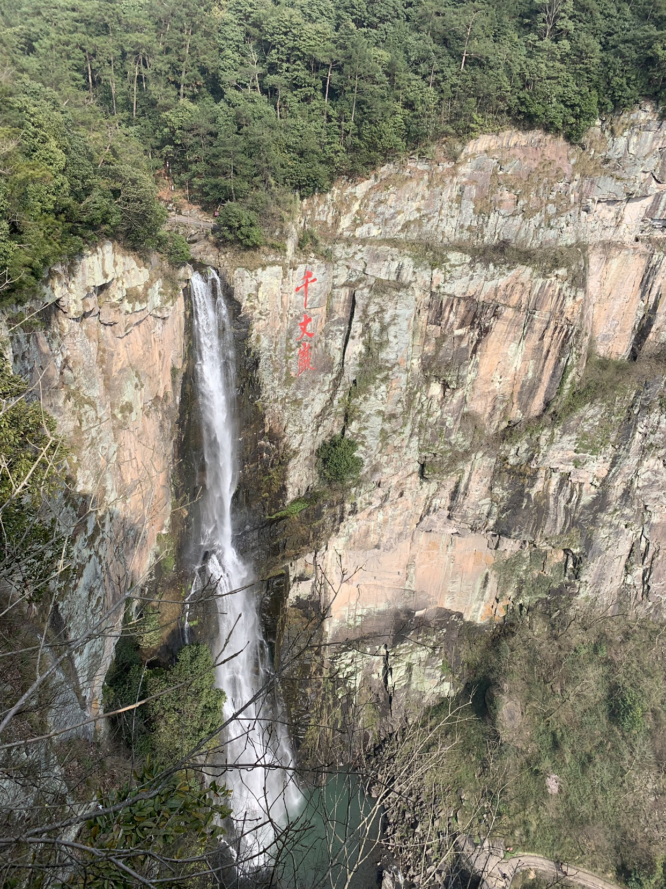
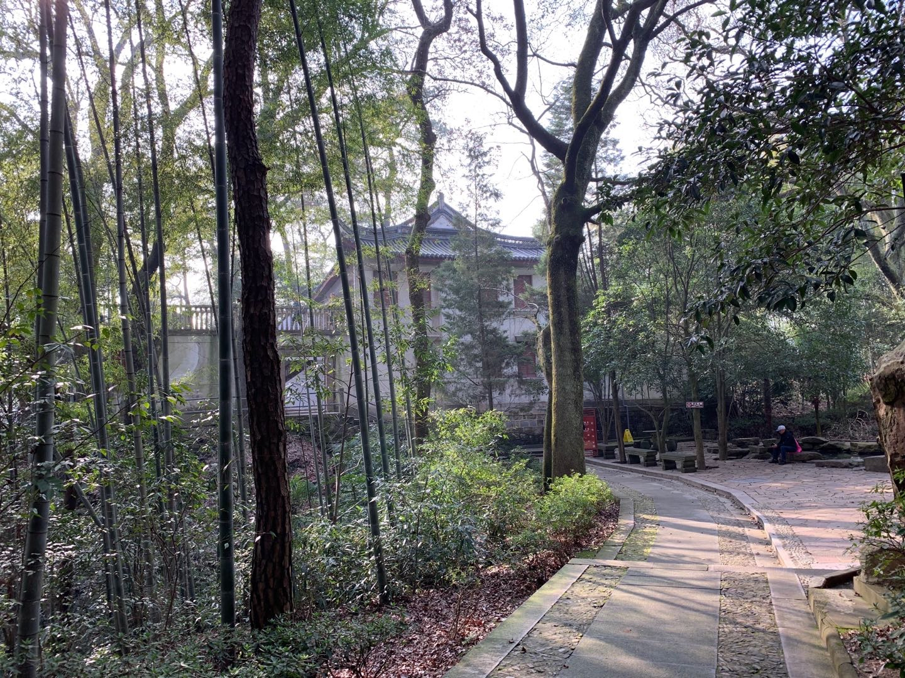

# 应梦游雪窦

*时间：2019年3月10日*

*地点：宁波奉化区雪窦山*

经常去宁波，不过一直没时间去玩玩，这次我们终于有时间去了趟奉化雪窦山。
我们吃了中饭后一行四人驱车前往，经过一个多小时到达目的地-雪窦山景区。

> 雪窦山被誉为“四明第一山”，是中国五大佛教名山之一的弥勒佛的道场。
> 又因北宋仁宗皇帝梦中到此一游而得名“应梦名山”

雪窦山以优美的自然风光著称，标志性景点包括千丈岩、雪窦寺、三隐潭、徐凫岩、妙高台以及全球最高的铜质坐姿弥勒佛造像。
此次我们主要游览了雪窦寺，千丈岩和妙高台。

### 弥勒道场

进了景区后沿着路线先是来到了雪窦寺。
> 位于雪窦山心的雪窦寺，创于晋、兴于唐、盛于宋，至今已有1700余年历史，是“天下禅宗十刹”之一，是未来佛弥勒的道场。

进了寺庙后，就可看到不远处山上的弥勒大佛。此寺颇为安静，没有其他名山名寺的人气，却有一种让人静心的从容。
拾阶而上，径直到了大佛脚下。心中默念。
由于时间比较匆忙，我们下来就离开了。

### 千丈岩

从雪窦寺出来，我们沿着雪窦山台阶一直往上。上山的过程和其他地方类似，到了千丈岩附近却感受到一股气势。远远就听到了瀑布的声音，走进后一股磅礴之势展现在眼前，走到边上一看着实壮观，应名**千丈岩**。

陡峭的山崖，一股清流直流而下，颇为壮观。

### 妙高台

妙高台就在千丈岩附近，可谓得其势，享其静。

> 妙高台背靠大山，中间凸起，三面峭壁，下临深渊，地势十分险峻。狭义的妙高台是指一块面积约350平方米的平台，站在台的前沿，可以暸望亭下湖的自然景色。妙高台周边古树茂密、翠竹蔽日，凉风习习，是一处理想的避暑胜地。

妙高台以前是蒋中正的别墅，到此一游的同时还上了一堂历史课。其中有当时抗战时期的一些珍贵照片和书信等。

### 结

本来还想坐索道到山下，不过由于时间较晚了，索道不售票了，因此只能沿着原路返回。
现在的人们都住在城市里，住在钢筋水泥构成的丛林中。有了先进的生活，但是离自然的生活却越来越远，想想小时候的很多乐趣现在都已经找寻不到了。

*在城市中好好努力，在自然中好好放松。*