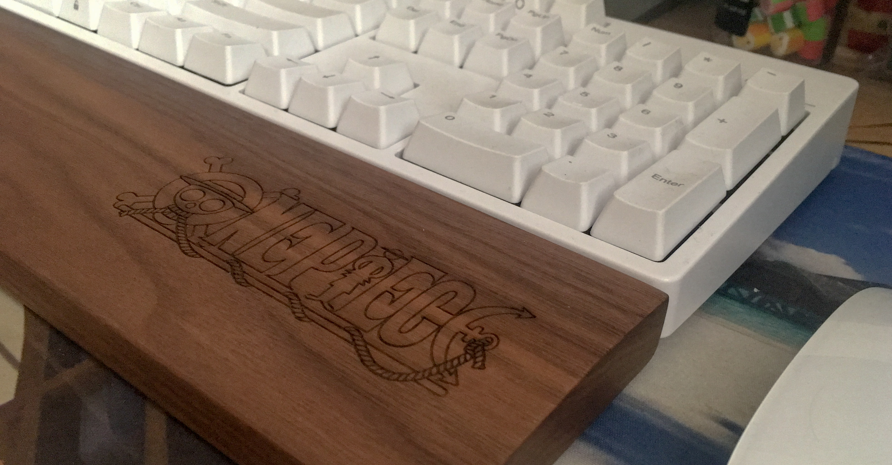

### 记事

> *直到前天晚上，我的键盘还一切安好。昨天却无缘无故的挂了,试了好几台电脑,什么iMac,笔记本都试了,死活没反应。。。*  

当初买键盘的时候考虑的都是机械键盘**寿命长**,樱桃轴按键舒服等等  

1. **首先,提起这个键盘,手感的话个人认为还是需要一个适应的过程.**  
   *机械键盘键程比较长,相对的手指的运动距离也加大了,导致误按的可能性增大？,和传统的印象刚好相反。(当然也可能是我使用不够熟练吧，刚刚买了个掌托，不知道会不会好点)。作为对比,键盘退回去维修后我又开始用iMac的键盘,几个月没用了,但是一上手的熟练度貌似明显好于机械键盘.*

2. **耐用性取决于相对最脆弱的地方**  
   *话说到目前为止薄膜键盘用了好多个,但是用坏的还真的没有.*
   *这机械键盘第一个用就跪了,买的ikbc的,虽说是入门级,但质量应该是差不多的.键盘按键都很好,但整个键盘一点反应都没了,而且从行到不行中间一点都没去动他(好娇贵的说)。*  
   *维修时居然反馈说没问题，（估计就是电路板或者线路哪里松了吧，谁知道呢。。。）。*

### 思考  

* 传统的观点未必是正确的或是适合自己的  
* 木桶效应随处可见，但是往往被我们忽略了，思考问题的时候不能片面化，应该全面的去分析

### 后续  

今天买了个键盘掌托,使用效果不错.  

> 让手指在打字时保持自然的姿势很重要

### 露脸照  
