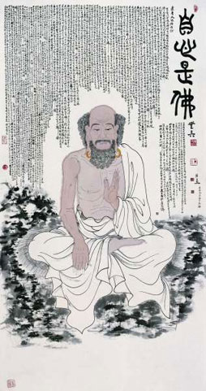

今年以来，白天上班晚上学习，我感觉找到了真正喜欢的生活方向。

兴趣以及执着一直带领着我前进，以至于我放下了其它好多活动，却还觉得时间不够用。

之一就是，前两年平时基本上还是会坚持锻炼一下身体，跑跑步或者在家里做做重力训练,

今年这项活动没了，然而我的身体也开始不同于以往了。

2018年三月发烧了一次，但是一直没重视导致肺炎，最近这几天因为病毒，又一次发烧。。。

身体实乃自己最后的支撑，好的时候没感觉，待异样之时才叹之可惜, 往往晚矣。

-----

看来现在开始又得新增一项任务了，劳逸结合才是生活学习之道。

凡事都讲究一个度，正如[宋] [法演禅师](http://www.nanputuo.com/nptsub/html/201503/1614561273499.html "五祖法演禅师悟道因缘")所言：

> * 第一势不可使尽。
> * 第二福不可受尽。
> * 第三规矩不可行尽。
> * 第四好语不可说尽。

